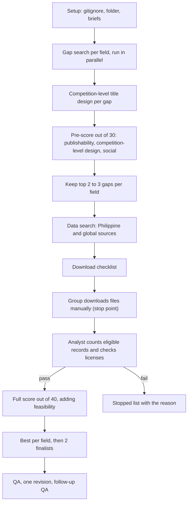

# Gap-first search across the four fields, with Philippine and global data

## What changes from the 6 October screen

The 6 October screen ([opportunity-map.md](docs/activities/litReview/four-field-titles/2026-10-06/opportunity-map.md)) also started from gaps, but it limited data to Philippine records. Every direction then failed the 10,000-record rule or stayed uncounted:

- GSHS ages 13 to 17 had 7,763 respondents.
- Globe at Night had 323 Philippine rows.
- WDPA had 274 protected-area designations.

This plan keeps the order of gap first, then data. The difference is that the data search covers Philippine sources **and** global sources:

- **Data scope:** a dataset may be Philippine, multi-country, or global, and it does not need Philippine rows. Philippine relevance comes from the beneficiary, the application, or a Philippine case study or test set. When a dataset does contain Philippine rows, use them as a held-out test region where possible.
- **Access:** manual browser downloads, including free account registration. Earth Engine, Copernicus accounts, scraping, primary data collection, and partner requests are excluded.
- **Publishable:** a Scopus- or IEEE-indexed conference or journal that has published comparable undergraduate-scale studies.
- **Marketable:** each title is designed to competition level against the standard below. No competition is searched or named in this run; matching titles to specific public-sector or private-sector competitions is a later step.
- **Output:** the best candidate in each field (four), then two recommended finalists.

Two safeguards keep a strong gap from dying for lack of data:

- Each gap card must name at least one plausible dataset lead before it advances.
- Each field keeps 2 to 3 gaps for the data search, so one failed data gate does not end the field.

The earlier folder stays as a historical record. Its two conditional directions, urban heat alerts and LGU radiance, may come back as gap seeds, but they must pass the new gates like any other candidate.

## Hard gates

G1, G2, and G6 are checked when a gap is written. G3, G4, and G5 are checked after the download.

- **G1 Title:** at most 16 words and names the algorithm or technique (guideline sections 2.1 and 2.2).
- **G2 Subdomain:** fits one of the 10 Data Science areas in the guideline: data mining, big data analytics, predictive analytics, feature engineering, recommendation systems, data visualization, anomaly detection, statistical modeling, data governance and ethics, or edge and IoT data analytics.
- **G3 Records:** at least 10,000 eligible records, counted by a script from the downloaded file, under a stated observation unit and independent unit, after exclusions (guideline section 4.1). A catalog total does not count.
- **G4 Rights:** the license allows thesis use, publication, and a public demonstration of the prototype, and the data comply with the Data Privacy Act of 2012 (guideline section 4.4). Noncommercial licenses (WHO GSHS, NOAA GSOD outside the US, Ookla CC BY-NC-SA) are flagged for the later competition-matching step, since some competitions involve commercial use.
- **G5 Access:** the group completed the manual download. A blocked agent fetch is recorded as not counted, not as a fail.
- **G6 Claims:** associations are not presented as causes. The project makes no individual diagnosis of minors and gives no legal or health label from imagery alone.

## Scoring

The first three criteria form the 30-point pre-score at the gap stage. Feasibility is added after the data gates, for a total out of 40, the same scale as the feasibility study's 32/40 hydroponics benchmark.

- **Publishability (0 to 10):**
  - the difference from the 3 to 5 nearest studies, each with its DOI opened;
  - an explicit limitation or future-work statement in those studies that the gap answers, quoted from opened text;
  - at least 2 Scopus- or IEEE-indexed venues from 2022 to 2026 that published comparable-scale studies.
- **Competition-level design (0 to 10, 2 points per element):** scored from the title card against the standard in the next section, not against any specific competition.
- **Social implication (0 to 10):** a named affected population, a Sustainable Development Goal (SDG) link, a decision the result would inform, and a harm analysis covering privacy, stigma, and misuse.
- **Feasibility (0 to 10, added after the data gates):** runs on a laptop with manual data, has a simple baseline, uses held-out sites, years, or countries, and fits three trimesters.

## Competition-level title design

Every gap that advances is written as a title card that would hold up in front of a judging panel. The five elements below follow the criteria competitions commonly judge on: problem, innovation, technical execution, impact, and scalability. This is a design standard, not a check against any particular competition's rules.

- **Named user and decision:** who acts on the output (a city disaster office, a school division, a telecom planner, an observatory) and which decision changes.
- **Demonstrable artifact:** a working prototype a judge can use in a few minutes, such as a risk map, an alert dashboard, a ranking tool, or an API. The prototype displays the model's output. It does not replace the research.
- **One-sentence innovation:** what this does that the nearest studies do not, readable without jargon. The sentence must be traceable to the gap card's prior-art comparison.
- **Measurable impact against a baseline:** a metric a judge can understand, such as false alerts avoided, recall at a fixed alert rate, coverage of underserved areas, or ranking accuracy compared with persistence, climatology, or a simple regression. It is written as a target to test, not a result.
- **Transfer or scale:** evidence the design works beyond one site, such as held-out countries, cities, years, or stations, with the Philippines as a test region where data allow.

Each title card also includes:
- **Title:** at most 16 words, in the form "[action] [outcome] for [context or user] Using [named technique]".
- **Pitch:** a 30-word version of the problem and the solution.
- **Ethics line:** the main risk to the affected population and how the design limits it.

## Gap seeds to test

These are not findings. Each one needs its nearest studies opened before it becomes a gap card.

- **Psychology:**
  - Whether models of adolescent belonging or bullying risk transfer across countries, including the Philippines (PISA 2022 or TIMSS 2019 as leads).
  - Subgroup fairness in wellbeing classifiers, compared across income levels (World Values Survey Wave 7 or pooled GSHS as leads).
- **Astronomy:**
  - Estimating sky brightness in regions with few observations, using a model trained on global citizen-science data (global Globe at Night and EOG VIIRS as leads).
  - Detecting geomagnetic disturbances at equatorial stations, which matters for GNSS positioning and the power grid (INTERMAGNET and OMNIWeb as leads).
- **Meteorology:**
  - Calibrated heat-index exceedance alerts that transfer across tropical cities (NOAA GSOD or ISD bulk files as leads).
  - Predicting rapid intensification of tropical cyclones before landfall (IBTrACS, SHIPS developmental data as leads).
  - Detecting anomalies in air-quality sensors (OpenAQ as a lead).
- **Urban:**
  - Digital-divide mapping from speed-test and building data (Ookla open tiles, Google Open Buildings, Meta Relative Wealth Index as leads).
  - Gaps in access to health facilities (OpenStreetMap and HDX layers as leads).
  - Hotspots in road-crash records, using global open crash data with a Philippine case if MMDA files are downloadable.

## Workflow

1. **Setup (coordinator).** Add a root `.gitignore` entry for `data/raw/`. Auto-sync pushes everything, and some licenses (WHO, GSOD) forbid redistribution. Then create `docs/activities/litReview/four-field-gaps/<run-date>/`, add a row to its `AI_INTERACTION_LOG.md`, and write the six-field briefs from [AGENTS.md](AGENTS.md).
2. **Gap search (4 literature-researcher agents in parallel, `$evidence-research` with the activity's OpenAlex and arXiv skills).**
   - Search 2022 to 2026 literature from at least two indexes. Start with review papers and the limitation and future-work sections of recent indexed studies.
   - Each field returns 3 to 5 gap cards. Each card has the nearest studies with opened DOIs, the gap statement, candidate indexed venues, the social implication, a draft title of at most 16 words, and at least one dataset lead from Philippine or global sources.
   - Output: `gap-candidates-<field>.md`.
3. **Title design (writer `$research-writing`, with the field's literature researcher).** Turn each gap into a competition-level title card using the five elements above. Output: `title-cards-<field>.md`.
4. **Pre-score and narrowing (coordinator).** Score each card out of 30 on publishability, competition-level design, and social implication, then drop any that fail G1, G2, or G6. Keep the top 2 to 3 per field. Output: `gap-prescore.md`.
5. **Data search (literature researchers and the statistical analyst).** For each kept gap, find 1 to 3 manually downloadable datasets from Philippine and global sources. Each entry records the official URL, license text, documented size and unit, any Philippine rows, and registration steps. Output: `dataset-register.csv`.
6. **Download checklist, then stop for the group.** `download-checklist.md` gives the URL, account step, exact file, target path `data/raw/<field>/<dataset>/`, and the license clause to read for each dataset. Work pauses until you confirm the files are on disk.
7. **Data gates (statistical analyst, `$quantitative-analysis`).** One counting script per dataset reads the raw files without modifying them. It reports the eligible count, missingness, the independent unit, leakage risks, and the G3 and G4 verdicts. Output: `data-gates.md`. A failing script is a failed result.
8. **Full score and shortlist (coordinator, with writer `$research-writing`).** Add feasibility for a score out of 40, then pick the best in each field and two finalists. Each finalist card includes the guideline 7.2 presentation items: titles, objectives, scope and limitations, algorithms, and target beneficiary. Outputs: `scorecard.md` and `shortlist.md`. Every claim is traced to `evidence-ledger.md`.
9. **QA (`$research-quality-review`).** Material findings go back to the responsible role for one revision, then one follow-up QA pass. Anything still unresolved is reported.

## Integrity limits carried over

- An abstract supports only what it states, and a repository mention is a lead, not verification.
- A gap is not called novel unless the nearest studies were actually searched and opened.
- Blocked pages are not bypassed.
- No model results are reported. This stage counts records and screens titles; it does not train models.
- No organization or competition is contacted, and no competition is searched in this run.
- Hydroponics and diesel stay separate tracks.
